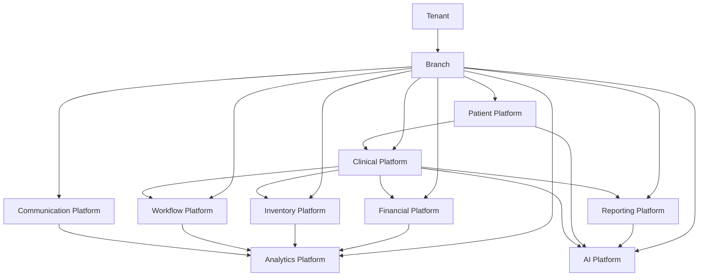

# Platform Overview Diagram

```mermaid
flowchart TB

    Tenant[Tenant]
    
    Tenant --> Branch[Branch]
    
    Branch --> Patient[Patient Platform]
    Branch --> Clinical[Clinical Platform]
    Branch --> Finance[Financial Platform]
    Branch --> Inventory[Inventory Platform]
    Branch --> Workflow[Workflow Platform]
    Branch --> Communication[Communication Platform]
    Branch --> Reports[Reporting Platform]
    Branch --> Analytics[Analytics Platform]
    Branch --> AI[AI Platform]

    Patient --> Clinical

    Clinical --> Finance
    Clinical --> Inventory
    Clinical --> Reports
    Clinical --> Workflow

    Finance --> Analytics
    Inventory --> Analytics
    Workflow --> Analytics
    Communication --> Analytics

    Reports --> AI
    Patient --> AI
    Clinical --> AI
```
