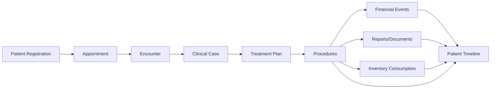

# Patient Journey Diagram

```mermaid
flowchart LR

    Registration[Patient Registration]

    Registration --> Appointment[Appointment]

    Appointment --> Encounter[Encounter]

    Encounter --> Case[Clinical Case]

    Case --> Treatment[Treatment Plan]

    Treatment --> Procedure[Procedures]

    Procedure --> Billing[Financial Events]

    Procedure --> Inventory[Inventory Consumption]

    Procedure --> Reports[Reports/Documents]

    Billing --> Timeline[Patient Timeline]

    Reports --> Timeline

    Inventory --> Timeline

    Procedure --> Timeline
```
