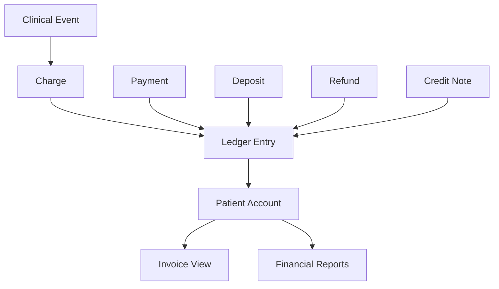

# Financial Engine Diagram

```mermaid
flowchart TB

    Clinical[Clinical Event]

    Clinical --> Charge[Charge]

    Charge --> Ledger[Ledger Entry]

    Payment[Payment]

    Payment --> Ledger

    Deposit[Deposit]

    Deposit --> Ledger

    Refund[Refund]

    Refund --> Ledger

    CreditNote[Credit Note]

    CreditNote --> Ledger

    Ledger --> PatientAccount[Patient Account]

    PatientAccount --> Invoice[Invoice View]

    PatientAccount --> Reports[Financial Reports]
```
