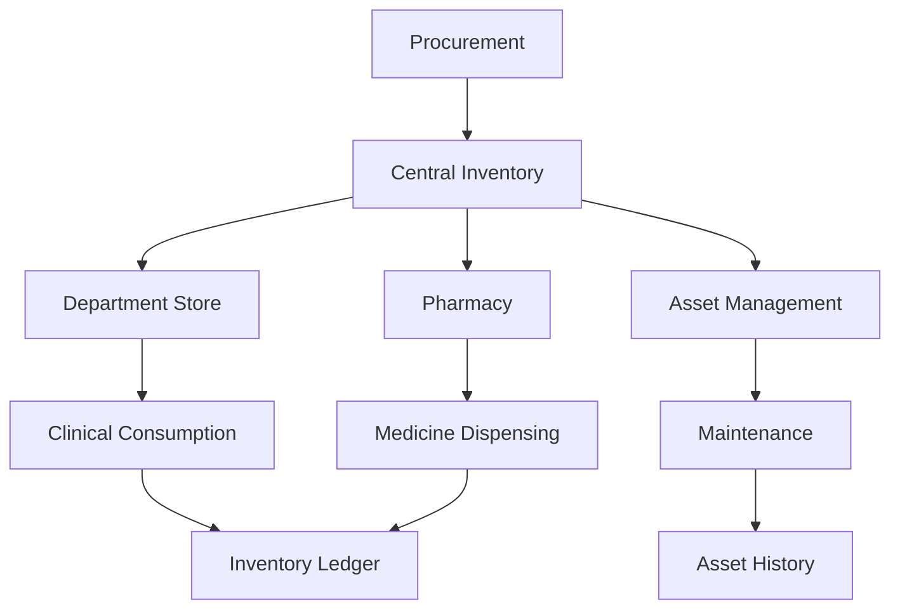

# Inventory Architecture Diagram

```mermaid
flowchart TB

    Procurement[Procurement]

    Procurement --> Inventory[Central Inventory]

    Inventory --> DepartmentStore[Department Store]

    Inventory --> Pharmacy[Pharmacy]

    Inventory --> Assets[Asset Management]

    DepartmentStore --> Consumption[Clinical Consumption]

    Pharmacy --> Dispensing[Medicine Dispensing]

    Assets --> Maintenance[Maintenance]

    Consumption --> StockLedger[Inventory Ledger]

    Dispensing --> StockLedger

    Maintenance --> AssetHistory[Asset History]
```
