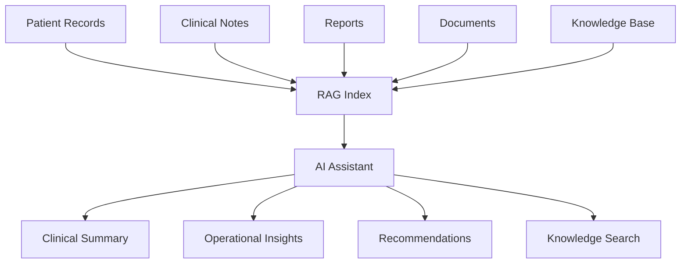

# AI & RAG Architecture Diagram

```mermaid
flowchart TB

    Patient[Patient Records]

    Clinical[Clinical Notes]

    Reports[Reports]

    Documents[Documents]

    SOPs[Knowledge Base]

    Patient --> RAG[RAG Index]

    Clinical --> RAG

    Reports --> RAG

    Documents --> RAG

    SOPs --> RAG

    RAG --> AI[AI Assistant]

    AI --> Summary[Clinical Summary]

    AI --> Insights[Operational Insights]

    AI --> Recommendations[Recommendations]

    AI --> Search[Knowledge Search]
```
